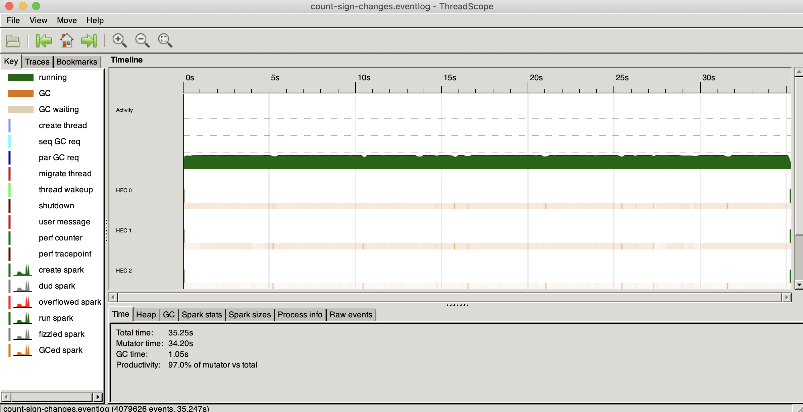
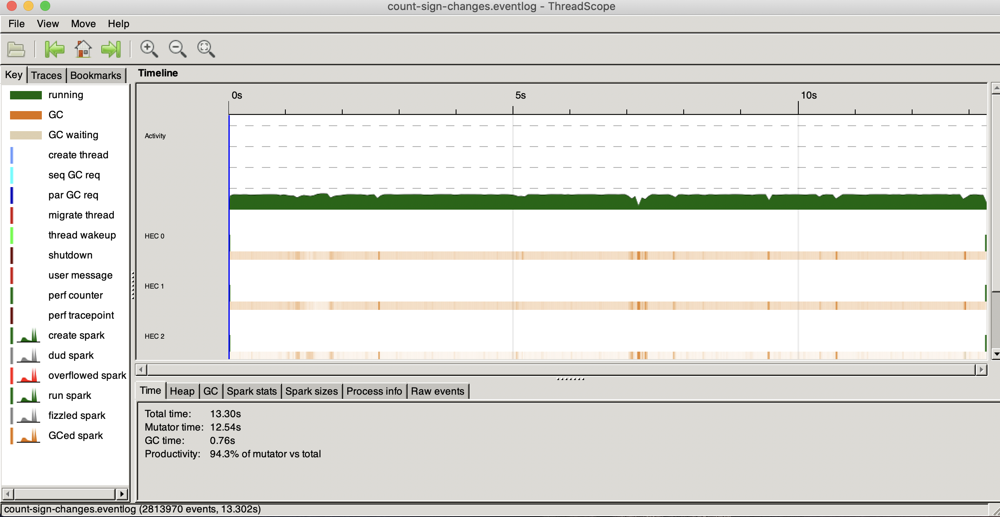
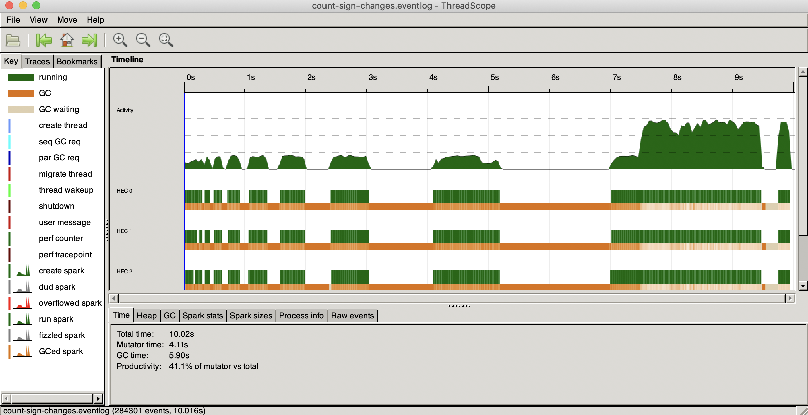
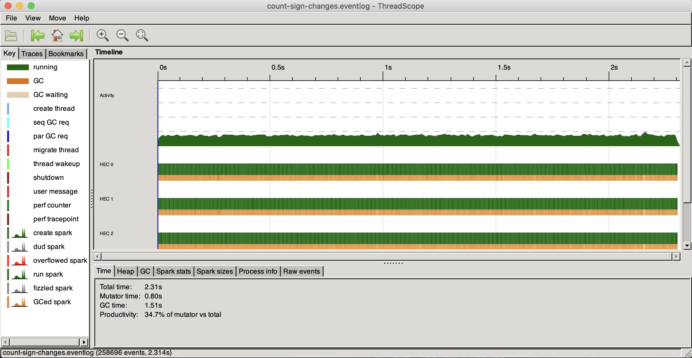

# parallel-and-concurency-training

# Prerequisites

You need to get stack from https://docs.haskellstack.org/en/stable/README/ in case if you don't have it

Also you may want to be able to see execution process in details https://github.com/haskell/ThreadScope

Then you can build everything with `$ stack build`

# Parallel

## Playground (count-sign-changes)

So, I came up with 2 algorithms (didn't think too much, probably there are much more simple and effective solutions)

```haskell
-- The first, and as it turned out, the fastest algorithm that I came up with
countSignChangesWithoutZip :: Integral a => [a] -> a
countSignChangesWithoutZip [] = 0
countSignChangesWithoutZip xs = fst $ foldl onSignCheck (0, head xs >= 0) xs
  where
    onSignCheck t@(count, switch) x = if switch /= (x >= count)
                                      then (succ count, not switch)
                                      else t
```

and

```haskell
-- The second algorithm to count sign changes in an array
countSignChanges :: Integral a =>  [a] -> a
countSignChanges [] = 0
countSignChanges xs = foldr (\(a, b) res -> if a >= 0 && b < 0 || a < 0 && b >= 0
                                            then succ res
                                            else res
                            ) 0 $ zip xs $ tail xs
```

So, lets test them, if you check out `count-sing-changes/Main.hs` then you'll this

```haskell
[x] -> show $ case x of
    "parallel"           -> parallel :: Int
    "parallelWithoutZip" -> parallelWithoutZip
    "nonParallel"        -> nonParallel
    _                    -> nonParallelWithoutZip
```

Algorithns process this list
```haskell
-- An example list to test algorithms
testList :: Integral a => [a]
testList = [0, -1] ++ [-1..600000000] ++ [ -1, -7 ]
```

With chunks size of 10000 for parallel algorithms

It means that there are 4 ways to test these algorithms

1. Running it as a non parallel algorithm
```bash
$ stack exec -- stack exec count-sign-changes -- nonParallel +RTS -l
```



2. Running it as a non parallel algorithm without zip
```bash
$ stack exec -- stack exec count-sign-changes -- nonParallelWithoutZip +RTS -l
```



3. Running it as a parallel algorithm
```bash
$ stack exec -- stack exec count-sign-changes -- parallel +RTS -l
```



4. Running it as a parallel algorithm without zip
```bash
$ stack exec -- stack exec count-sign-changes -- parallelWithoutZip +RTS -l
```


