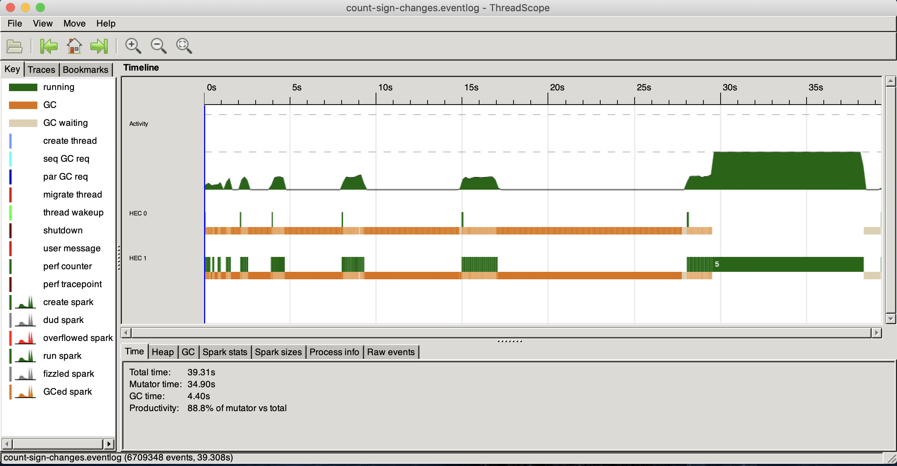
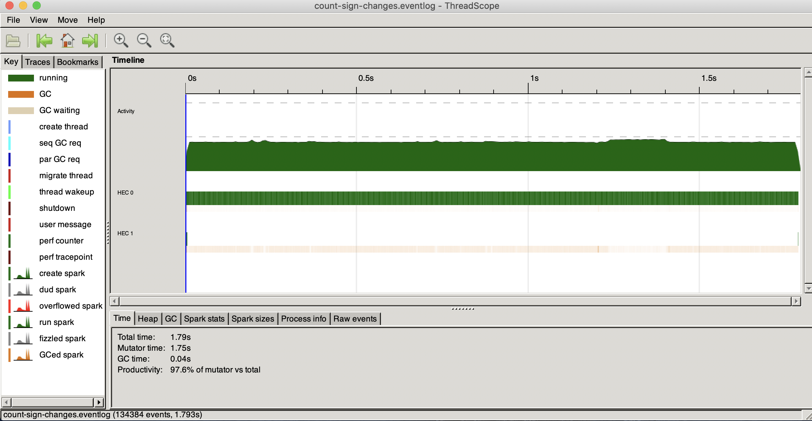
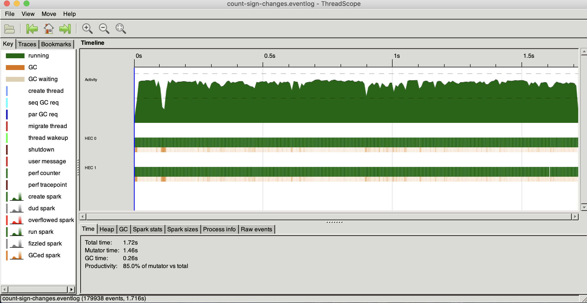

# parallel-and-concurency-training

# Prerequisites

You need to get stack from https://docs.haskellstack.org/en/stable/README/ in case if you don't have it

Also you may want to be able to see execution process in details https://github.com/haskell/ThreadScope

Then you can build everything with `$ stack build`

# Parallel

## Playground (count-sign-changes)

So, I came up with 2 algorithms (didn't think too much, probably there are much more simple and effective solutions)

```haskell
-- The first, and as it turned out, the fastest algorithm that I came up with
countSignChangesWithoutZip :: Integral a => [a] -> a
countSignChangesWithoutZip [] = 0
countSignChangesWithoutZip xs = fst $ foldl onSignCheck (0, head xs >= 0) xs
  where
    onSignCheck t@(count, switch) x = if switch /= (x >= count)
                                      then (succ count, not switch)
                                      else t
```

and

```haskell
-- The second algorithm to count sign changes in a list
countSignChanges :: Integral a =>  [a] -> a
countSignChanges [] = 0
countSignChanges xs = foldr (\(a, b) res -> if a >= 0 && b < 0 || a < 0 && b >= 0
                                            then succ res
                                            else res
                            ) 0 $ zip xs $ tail xs
```

Lets test them, if you check out [count-sign-changes/Main.hs](count-sign-changes/Main.hs) then you'll see this

```haskell
[x] -> show $ case x of
    "parallel"           -> parallel :: Int
    "parallelWithoutZip" -> parallelWithoutZip
    "nonParallel"        -> nonParallel
    _                    -> nonParallelWithoutZip
```

Algorithms process this list
```haskell
-- An example list to test algorithms
testList :: Integral a => [a]
testList = [0, -1] ++ [-1..100000000] ++ [ -1, -7 ]
```

For this list the answer will be `3`, first change on -1, second on 0 and the last on -1

With chunks size of `10000` for parallel algorithms

It means that there are 4 ways to test these algorithms

1. Running it as a non parallel algorithm
```bash
$ stack exec -- stack exec count-sign-changes -- nonParallel +RTS -N2 -l
```



2. Running it as a non parallel algorithm without zip

It uses thist code to calculate it in parallel

```haskell
-- Parallel functions
parallelCustom :: ([Integer] -> Int) -> Int
parallelCustom f =  runEval $ pure $ sum $ parMap rpar f $ chunksOf chunkSize testList
  where
    chunkSize = 10000

parallel, parallelWithoutZip :: Int
parallel           = parallelCustom countSignChanges
parallelWithoutZip = parallelCustom countSignChangesWithoutZipTuned
```

```bash
$ stack exec -- stack exec count-sign-changes -- nonParallelWithoutZip +RTS -N2 -l
```



3. Running it as a parallel algorithm
```bash
$ stack exec -- stack exec count-sign-changes -- parallel +RTS -N2 -l
```


4. Running it as a parallel algorithm without zip
```bash
$ stack exec -- stack exec count-sign-changes -- parallelWithoutZip +RTS -N2 -l
```



As we can see, there is a huge speedup between 1 and 3, but there almost no difference between 2 and 4
